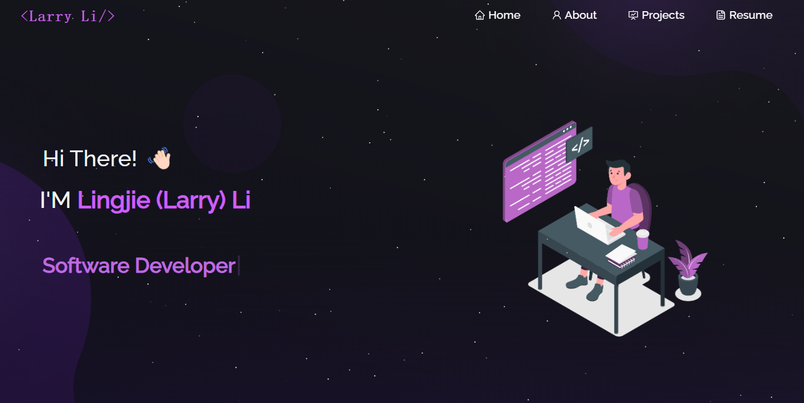

<h2 align="center">
  Portfolio Website - Lingjie (Larry) Li 
  <a href="https://lingjielarryli.com" target="_blank">lingjielarryli.com</a>
</h2>

  

 

<h3 align="center">
  Developed by <strong>Lingjie (Larry) Li</strong>
</h3>

---

## 💡 Overview

This is my personal portfolio website built with React. It showcases my featured projects, technical skills, resume, and contact information. Feel free to explore or use it as a reference for your own site!

## 🚀 Built With

- React.js  
- Node.js  
- Express.js  
- CSS3  
- React Bootstrap  
- Vercel  

## ✨ Features

- 📄 Multi-page layout with smooth navigation  
- 🎨 Customizable theme with CSS and Bootstrap  
- 📱 Fully responsive across desktop and mobile  

## Getting Started

Clone down this repository. You will need `node.js` and `git` installed globally on your machine.

## 🛠 Installation and Setup Instructions

1. Installation: `npm install`

2. In the project directory, you can run: `npm start`

Runs the app in the development mode.\
Open [http://localhost:3000](http://localhost:3000) to view it in the browser.
The page will reload if you make edits.
